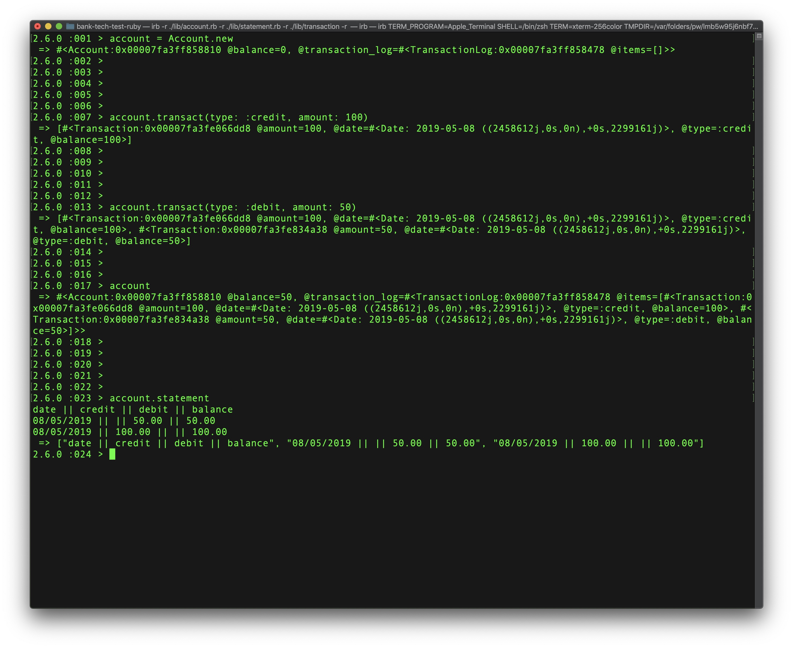

# Bank Tech Test
Create a REPL/JS Console app that simulates a bank account with common actions like deposits, withdrawals and statements

## Using this Code
Run the following commands to get started with this code:

1. Clone the repo:
```
git clone https://github.com/acodeguy/bank-tech-test-ruby
```
2. Change into the newly-cloned directory:
```
cd bank-tech-test-ruby
```
3. Install required Gems:
```
bundle install
```
4. Run the code in IRB:
```
irb -r ./lib/account.rb -r ./lib/statement.rb -r ./lib/transaction.rb -r ./lib/transaction_log.rb
```
Once IRB has loaded, here is how you interact with the Bank:
```
2.5.0 :006 > account = Account.new
 => #<Account:0x00007fd7b291f0c8 @balance=0, @transaction_log=#<TransactionLog:0x00007fd7b291f0a0 @items=[]>> 
2.5.0 :007 > account.transact(type: :credit, amount: 100)
 => [#<Transaction:0x00007fd7b18e6d28 @amount=100, @date=#<Date: 2019-04-09 ((2458583j,0s,0n),+0s,2299161j)>, @type=:credit, @balance=100>] 
2.5.0 :008 > account.transact(type: :debit, amount: 50)
 => [#<Transaction:0x00007fd7b18e6d28 @amount=100, @date=#<Date: 2019-04-09 ((2458583j,0s,0n),+0s,2299161j)>, @type=:credit, @balance=100>, #<Transaction:0x00007fd7b290e908 @amount=50, @date=#<Date: 2019-04-09 ((2458583j,0s,0n),+0s,2299161j)>, @type=:debit, @balance=50>] 
2.5.0 :009 > account.statement
date || credit || debit || balance
09/04/2019 || || 50.00 || 50.00
09/04/2019 || 100.00 || || 100.00
 => ["date || credit || debit || balance", "09/04/2019 || || 50.00 || 50.00", "09/04/2019 || 100.00 || || 100.00"] 
2.5.0 :010 > 
```

## Requirements

You should be able to interact with your code via a REPL like IRB or the JavaScript console. (You don't need to implement a command line interface that takes input from STDIN.)
Deposits, withdrawal.
Account statement (date, amount, balance) printing.
Data can be kept in memory (it doesn't need to be stored to a database or anything).

## User Stories
```
As a customer
So that I know how much money I have
I want to be able to check my balance
```
```
As a customer
So that I can put money into my account
I want to be able to deposit money into my account
```
```
As a customer
So that I can take my out of my account
I want to be able to withdraw money from my account
```
```
As a customer
So that I can see my past transactions
I want to be able to print an account statement
```

## Code Quality

- Tests were written with RSpec, passing with 98% coverage
- Code was linted with Rubocop

## Acceptance criteria
```
Given a customer makes a deposit of 1,000 on 10/01/2012
And a deposit of 2,000 on 13/01/2012
And a withdrawal of 500 on 14/01/2012
When she prints her bank statement
Then she would see
```
```
date || credit || debit || balance
14/01/2012 || || 500.00 || 2,500.00
13/01/2012 || 2,000.00|| || 3,000.00
10/01/2012 || 1,000.00|| || 1,000.00
```

## Screenshots


## Approach
From the outset I knew that one class was not going to cover this program properly, so I started with feature tests in IRB for how I wanted the program to behave then transferred these failing features to RSpec tests which drove the development along.

I was guilty of writing the tests tightly coupled to external units, however I have since re-visited this project and used test doubles to keep the tests isolated.

I've used dependency injection where possible to remove reliance on lower-level modules and keep the code as readable, short and easy to change to possible.

## Enhancements I'd Make

1. Use commas as thousands separator on statement
2. Make it interactive rather than REPL